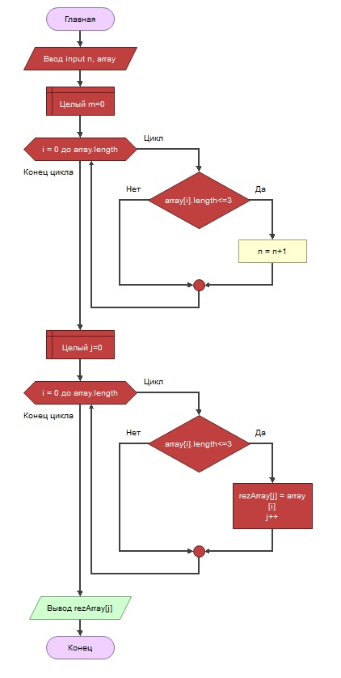

# Итоговая проверочная работа.
## Задача: Написать программу, которая из имеющегося массива строк формирует новый массив из строк, длина которых меньше, либо равна 3 символам. Первоначальный массив можно ввести с клавиатуры, либо задать на старте выполнения алгоритма. При решении не рекомендуется пользоваться коллекциями, лучше обойтись исключительно массивами.
## Примеры:
- [“Hello”, “2”, “world”, “:-)”] → [“2”, “:-)”]
- [“1234”, “1567”, “-2”, “computer science”] → [“-2”]
- [“Russia”, “Denmark”, “Kazan”] → []
## Описание работы програмы.
- Сначала надо ввести размерность массива (n).
- Затем вводятся сами элементы исходного массива. Ввод элементов выполняется отдельной процедурой (FillArray).
- В функции NewFillArray в первомцикле происходит подсчёт количества элементов (m), длина строк которых меньше, либо равна 3 символам.
- Во втором цикле происхдит формирование нового массива строк, длина которых не превышает 3 символа.
- В процедуре PrintArray идет вывод новго массива на консоль.

## Блок-схема алгоритма выполнения программы:
